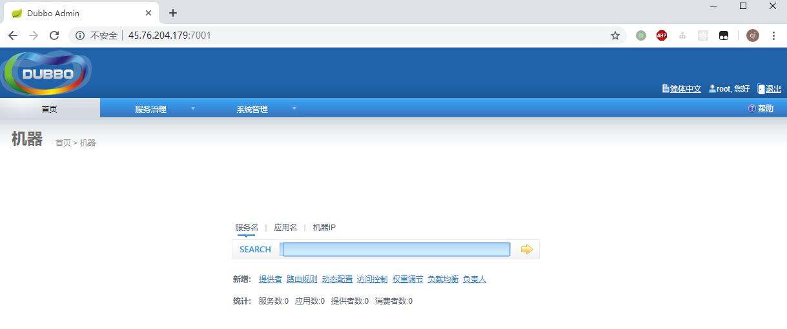

## docker-compose 组合dubbo-admin和zookeeper示例

打开一台新安装的云服务或虚拟机, 执行以下脚本
```
yum install -y git
git clone https://github.com/xuqifzz/docker-compose-dubbo-admin-zk.git
cd docker-compose-dubbo-admin-zk/
bash init.sh
```
访问 服务器ip:7001, 账号密码输入root/root, 可以成功访问

